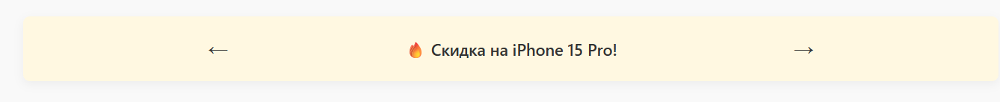
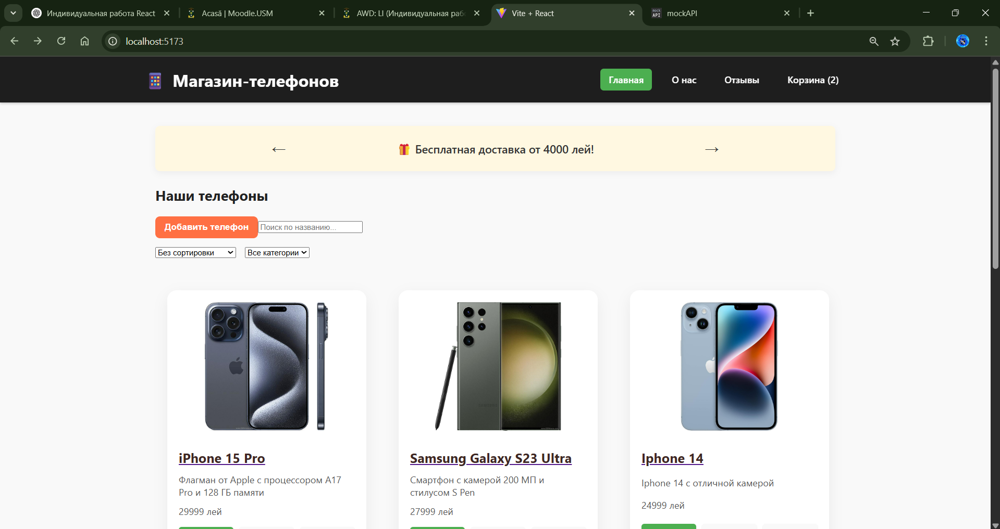
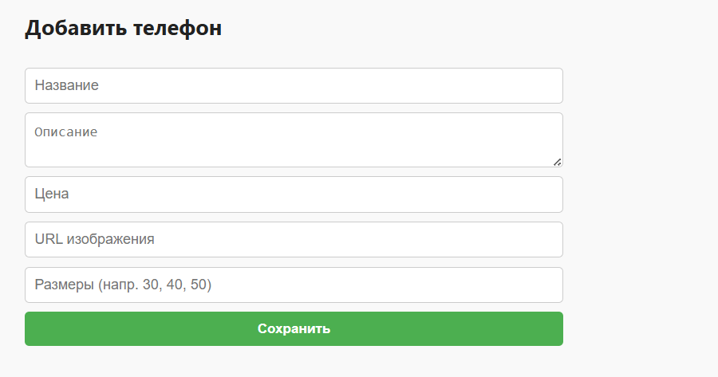
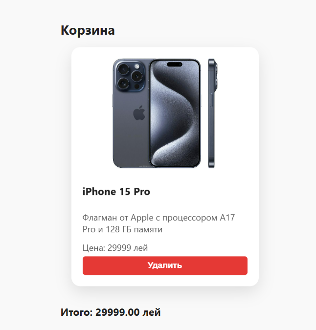
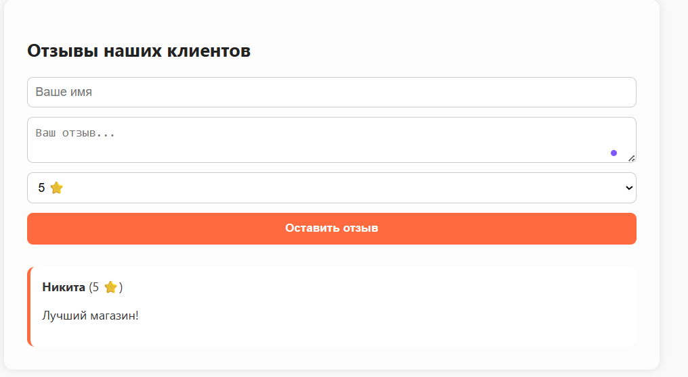

#  Магазин телефонов (React + Redux Toolkit)

##  Описание проекта

**Магазин телефонов** — это клиентское веб-приложение, созданное на **React** с использованием **Redux Toolkit**. Пользователь может:

* Просматривать телефоны
* Сортировать, фильтровать и искать
* Добавлять, редактировать и удалять товары
* Добавлять телефоны в корзину
* Оставлять отзывы

Проект реализует ключевые навыки:

* REST API через [MockAPI](https://mockapi.io)
* CRUD-операции (Create, Read, Update, Delete)
* Глобальное состояние с Redux Toolkit
* Валидация форм и сообщения об ошибках
* Страница отзывов

---

##  Основные функции (с кодом)

###  Просмотр списка телефонов

```js
{filteredPhones.map((phone) => (
  <PhoneCard key={phone.id} phone={phone} onAdd={() => handleAddToCart(phone)} />
))}
```

###  Слайдер с акциями

```js
const slides = [
  "🔥 Скидка на iPhone 15 Pro!",
  "🎁 Бесплатная доставка от 4000 лей!",
  "📱 Новинка: Samsung Galaxy S24!"
];

useEffect(() => {
  const timer = setInterval(nextSlide, 3000);
  return () => clearInterval(timer);
}, []);
```

```jsx
<div className="slider">
  <button onClick={prevSlide}>←</button>
  <span>{slides[currentSlide]}</span>
  <button onClick={nextSlide}>→</button>
</div>
```

---

##  Примеры интерфейса

* Слайдер акций
  

###  Добавление телефона

```js
await axios.post(API_URL, payload);
```

###  Редактирование и  удаление телефона

```js
await axios.put(`${API_URL}/${id}`, payload);
await axios.delete(`${API_URL}/${id}`);
```

###  Сортировка

```js
sorted.sort((a, b) => parseFloat(a.price) - parseFloat(b.price));
sorted.sort((a, b) => a.name.localeCompare(b.name));
```

###  Фильтрация по категориям

```js
const filtered = phones.filter((p) => p.category === selected);
```

###  Поиск по названию и описанию

```js
const filtered = phones.filter(
  (phone) =>
    phone.name.toLowerCase().includes(lower) ||
    phone.description.toLowerCase().includes(lower)
);
```

###  Корзина + подсчет суммы (Redux Toolkit)

```js
const total = cart.reduce((sum, phone) => sum + parseFloat(phone.price), 0).toFixed(2);
```

###  Отзывы

```js
<form onSubmit={handleSubmit} className="review-form">
  ...
</form>
```

###  Сетка карточек телефонов

```css
.phone-list {
  display: grid;
  grid-template-columns: repeat(auto-fill, minmax(280px, 1fr));
}
```

---

##  Redux Toolkit (пример настройки)

```js
// store/store.js
export const store = configureStore({
  reducer: {
    cart: cartReducer,
  },
});
```

---

##  Технологии

* React 18
* React Router DOM
* Redux Toolkit
* Axios
* Lodash.debounce
* MockAPI
* Чистый CSS (ручная стилизация)

---

##  Установка и запуск

1. Клонируйте проект:

```bash
git clone https://github.com/your-username/phone-store-react.git
cd my-phone-app
```

2. Установите зависимости:

```bash
npm install
```

3. Запустите:

```bash
npm run dev
```

4. Откройте [http://localhost:5173](http://localhost:5173)

---

##  Примеры интерфейса

* Главная страница
 

* Добавление телефона
  

* Корзина
  

* Отзывы
  

---

##  Источники

* [React](https://reactjs.org/)
* [Redux Toolkit](https://redux-toolkit.js.org/)
* [Axios](https://axios-http.com)
* [MockAPI](https://mockapi.io)
* [Lodash debounce](https://lodash.com/docs/4.17.15#debounce)

---

##  Дополнительно

* Корзина сохраняется в `localStorage`
* Код снабжен JSDoc-комментариями
* Все данные синхронизированы с MockAPI
* Адаптивная и чистая верстка без фреймворков

